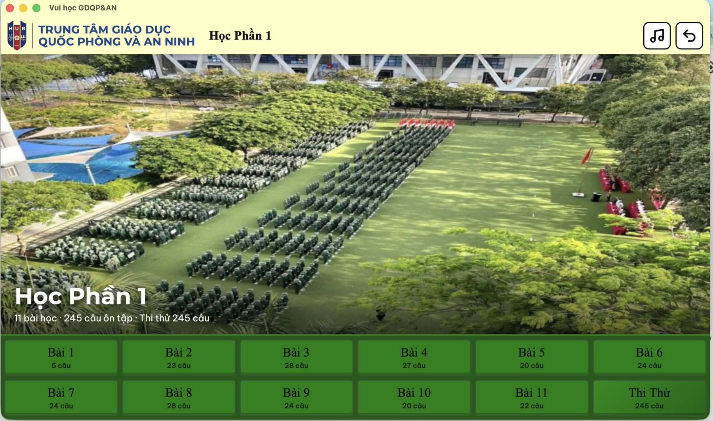
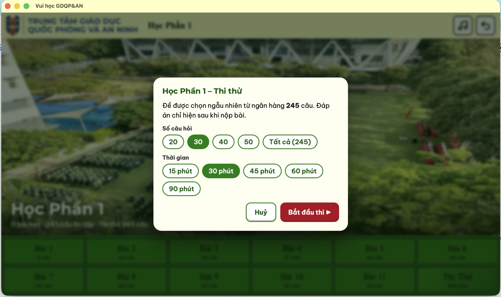

<p align="center">
  
</p>

<h1 align="center">Vui học GDQP&AN</h1>

<p align="center">
  Ôn tập theo từng bài học, luyện thi thử có tính giờ cho học phần Giáo dục Quốc phòng & An ninh.<br>
  Chạy trên trình duyệt hoặc app desktop macOS / Windows.
</p>

<p align="center">
  
  <br><sub><b>Trang chủ</b> · chọn học phần</sub>
</p>

<table align="center">
  <tr>
    <td align="center" width="50%">
      
      <br><sub><b>Học phần</b> · ôn tập theo từng bài</sub>
    </td>
    <td align="center" width="50%">
      
      <br><sub><b>Thi thử</b> · chọn số câu và thời gian</sub>
    </td>
  </tr>
</table>

Trang web ôn tập và thi thử cho sinh viên. Không cần server: mở `web/index.html` bằng trình duyệt là chạy.

## Cấu trúc

```
web/
├── index.html
├── css/style.css
├── js/app.js
├── data/data.json      # cây JSON duy nhất (dễ đọc)
├── data/data.js        # cùng nội dung, để chạy trực tiếp bằng file://
├── assets/             # logo, ảnh sân trường, chuông (trích từ thư mục design)
└── audio/              # nhạc nền + nhạc kết thúc bài thi (chuyển từ /Audio sang .m4a)
tools/build_data.py     # chuyển Excel -> JSON
```

## Cập nhật câu hỏi

Sửa/thêm file `HP*/Bài n/Đề m/data.xlsx` hoặc `HP*/Thi Thử/Đề m/data.xlsx`
(cột: Question Text | Option 1..4 | Correct Answer), sau đó chạy:

```bash
pip install openpyxl
python3 tools/build_data.py
```

Thêm học phần (HP3…), bài, hay đề mới (Đề 2…) sẽ được nhận tự động.

## Tính năng

- **Luyện tập**: chấm ngay khi chọn đáp án, pháo giấy và âm thanh khi đúng, rung đỏ khi sai, nút **Đáp Án** để xem đáp án.
- **Thi thử**: chọn số câu và thời gian, đề ngẫu nhiên, đồng hồ đếm ngược, hết giờ thì chuông reo; có xem lại bài sau khi nộp.
- Thứ tự phương án được trộn mỗi lần làm (dữ liệu gốc luôn để đáp án đúng ở vị trí 1). Câu có phương án kiểu "Cả A và C" giữ nguyên thứ tự; câu có phương án "Tất cả đều đúng" thì phương án đó luôn nằm cuối.
- Lưu điểm cao nhất từng bài trên trình duyệt (localStorage).
- Phím tắt: `A–D`/`1–4` chọn đáp án · `←/→` chuyển câu · `Space` xem đáp án · `M` bật/tắt nhạc · `Esc` quay lại.
- Trên điện thoại có thể vuốt trái/phải để chuyển câu.

## Ứng dụng desktop (Tauri)

Thư mục `web/` được đóng gói thành app desktop cho macOS và Windows bằng [Tauri v2](https://tauri.app)
(cấu hình trong `src-tauri/`). Font chữ được nhúng sẵn trong `web/fonts/` nên app chạy hoàn toàn offline.

### Chuẩn bị (làm một lần trên mỗi máy)

| | macOS | Windows |
|---|---|---|
| Node.js 18+ | https://nodejs.org | https://nodejs.org |
| Rust | `curl https://sh.rustup.rs -sSf \| sh` | https://rustup.rs (chọn toolchain **MSVC**) |
| Công cụ biên dịch | `xcode-select --install` | Visual Studio Build Tools, mục **Desktop development with C++** |

Lấy mã nguồn bằng `git clone` (nếu chép thủ công thì **không** chép `node_modules/` và `src-tauri/target/`).

### Build bằng script

Script tự cài dependencies, build, rồi gom file kết quả vào thư mục `dist/`.

**macOS**

```bash
./scripts/build-mac.sh            # bản universal (chip Apple M + Intel)
./scripts/build-mac.sh --native   # chỉ cho chip của máy đang dùng, build nhanh hơn
```

Kết quả trong `dist/mac/`:

- `Vui Hoc GDQP-AN_<version>_universal.dmg`: file cài đặt, mở ra rồi kéo app vào **Applications**.
- `Vui Hoc GDQP-AN_<version>_mac.zip`: app nén sẵn, giải nén là dùng.

**Windows**: nhấp đúp `scripts\build-windows.bat`, hoặc chạy trong PowerShell:

```powershell
.\scripts\build-windows.ps1
```

Kết quả trong `dist\windows\`:

- `Vui Hoc GDQP-AN_<version>_x64-setup.exe`: bộ cài đặt (tự cài WebView2 nếu máy chưa có).
- `Vui Hoc GDQP-AN_<version>_x64_en-US.msi`: bộ cài dạng MSI.
- `Vui Hoc GDQP-AN_<version>_portable.exe`: không cần cài, nhấp đúp là chạy (cần WebView2, có sẵn trên Windows 10/11).

Lần build đầu mất vài phút để biên dịch Rust; các lần sau nhanh hơn. Khi tạo `.msi`, Tauri tự tải WiX nên máy cần có mạng.

### Lệnh npm (dành cho phát triển)

```bash
npm install
npm run dev         # mở app ở chế độ phát triển
npm run build:mac   # macOS universal -> .app và .dmg
npm run build       # build cho hệ điều hành hiện tại
```

File đầu ra gốc nằm trong `src-tauri/target/<target>/release/bundle/`.

### Build bằng GitHub Actions

Workflow `.github/workflows/build-desktop.yml` build cả macOS và Windows trên máy chủ GitHub:

- Đẩy tag, ví dụ `git tag v1.0.0 && git push origin v1.0.0`: tạo bản nháp Release kèm `.dmg`, `.exe`, `.msi`.
- Hoặc vào tab **Actions → Build desktop app → Run workflow**: tải file trong mục *Artifacts* của lần chạy.

### Tuỳ chỉnh

- Đổi phiên bản: sửa `version` trong `src-tauri/tauri.conf.json`.
- Đổi icon: thay `src-tauri/app-icon.png` (vuông, ≥ 1024px) rồi chạy `npx tauri icon src-tauri/app-icon.png`.

> App chưa được ký số. Lần đầu mở trên macOS: chuột phải vào app → **Open**. Trên Windows, nếu SmartScreen cảnh báo: **More info → Run anyway**.
